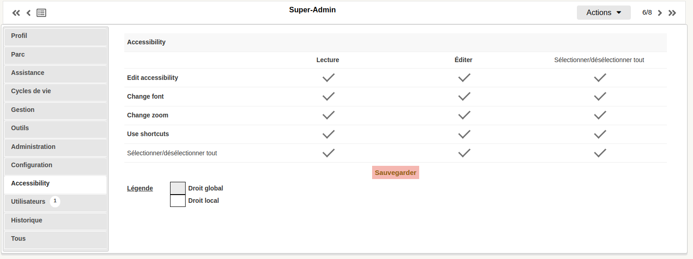
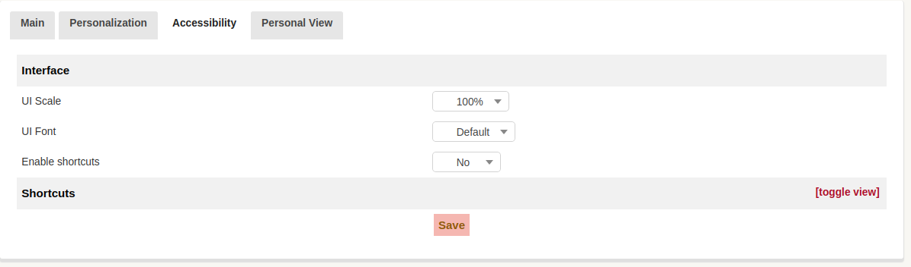
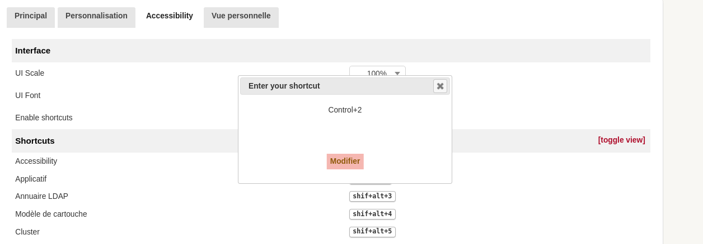

# About Accessibility in ITSM-NG

Accessibility is a component that allows the user to navigate easily on the ITSM-NG interface, making it suitable for and each every user.

## List of available accessibility options

* Font change
* Zoom level
* Keyboard shortcuts

### Change UI zoom
Change the default zoom level using this feature 

### Change UI font
You may want to change the ITSM-NG font, then select the font you want to use.

`Note : Open-Dyslexic is an open sourced font created to increase readability for readers with dyslexia.`

* Open Dyslexic Regular
* Open Dyslexic Alta
* Tiresias Infofont

Go to the folloming link for more information https://opendyslexic.org/

### Use Keyboard shortcuts
If they are enabled and configured, you can use shortcuts to switch between tabs

## Supported browsers
* FireFox
* Brave
* Chrome
* Edge

`Note : FireFox does not implement the zoom css directive.`

## Configuration

Allow permission to the current user in `Profils`.

## How to setup accessibility

Go to `Preference(My settings)` / `Accessibility` 

Here you can change the `font` and `scale`

You can also `Enable/Disable` the shortcuts

To Set shortcuts: `toggle` the views and select the shortcuts you want to set 

