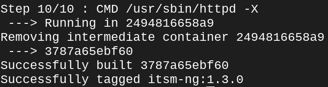
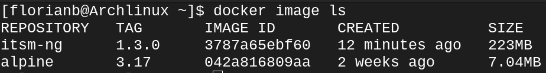

# Build ITSM-NG docker image
## Get the source source
The source code is available here: https://github.com/itsmng/itsmng-docker
```
git clone https://github.com/itsmng/itsmng-docker
```

Go to chose version
```
cd 1.3.0
```

Launch the build of the docker image
```
docker build -t itsm-ng:1.3.0 .
```
The syntaxe is ***docker build -t NameOfTheImage:Version***



If this command return  ***"Successfully tagged NameOfTheImage:Version"*** your build is working.

You can also view your image with the command.
```
docker image ls
```

