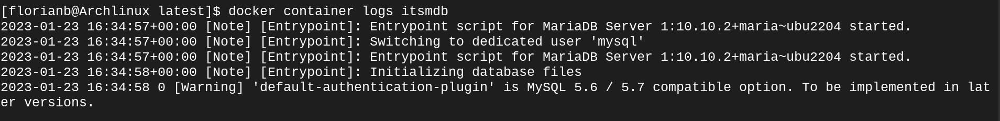
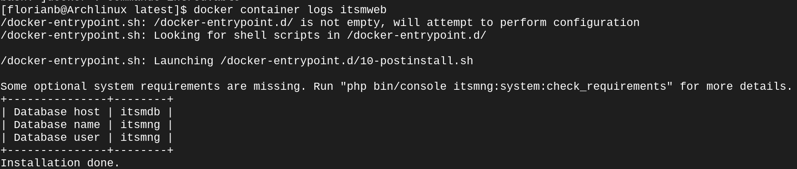

# Introduction
Thank you for downloading the ITSM-NG docker setup !

# Installation
```
git clone https://github.com/itsmng/itsmng-docker
cd itsmng-docker
```
To chose your version you go simply on the directory version exemple 1.4 directory or latest for the last version.
```
cd latest
```

## Securize your Installation
By default in this exemple the MariaDB user,password and datase is itsmng. To change this setting you can edit the ***MARIADB_USER,MARIADB_PASSWORD*** and the ***MARIADB_DATABASE*** variable.

## Start the container
```
docker-compose up -d
```


You ITSM-NG is available on the address http://localhost

## Check if container is Running
```
docker container ls -a
```


If the container is running the status is "UP"

# View the logs
## For MariaDB
```
docker container logs itsmdb
```


## For ITSM-NG
```
docker container logs itsmweb
```



# What files need to be backup 
The docker volumes created must be backup to avoid losing your data.

| Volumes        | Description                                                                   |
|----------------|-------------------------------------------------------------------------------|
| itsmng-config  | He contain the database Information, the name and the login of MySQL database |
| itsmng-plugins | He contain all of the ITSM-NG plugins files                                   |
| itsmng-files   | He contain all of the attachments, and profile picture                        |
| itsmdata       | He contain all of the files of MariaDB.                                       |

This volume is a folder in your docker-compose directory.

# How to update ITSM-NG
* Go the current install version oif itsm
```
cd 1.3.0
```
* Stop the container
```
docker-compose down
```
* Go to the new version
```
cd ../1.4.0
```
* Start the container
```
docker-compose up -d
```
