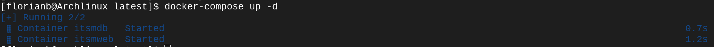
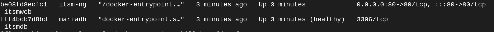

# Introduction
Thank you for downloading the ITSM-NG docker setup !

# Installation
```
git clone https://github.com/itsmng/itsmng-docker
cd itsmng-docker
```
To choose your version, you simply go to the directory of the chosen version, for example the folder 1.4 for version 1.4 or latest for the last version.
```
cd latest
```

## Secure your Installation
By default, in this example, the MariaDB user,password and database is itsmng. To change this setting you can edit the ***MARIADB_USER,MARIADB_PASSWORD*** and the ***MARIADB_DATABASE*** variable.

## Start the container
```
docker-compose up -d
```


You ITSM-NG is available on the address http://localhost

## Check if the container is Running.
```
docker container ls -a
```


If the container is running, the status is "UP".

# View the logs
## For MariaDB
```
docker container logs itsmdb
```


## For ITSM-NG
```
docker container logs itsmweb
```


# What files need to be backup 
The docker volumes created must be backup to avoid losing your data.

| Volumes        | Description                                                                               |
|----------------|-------------------------------------------------------------------------------------------|
| itsmng-config  | The directory contains the database Information, the name and the login of MySQL database |
| itsmng-plugins | The directory contains all the ITSM-NG plugins files                                   |
| itsmng-files   | The directory contains of the attachments, and profile picture                            |
| itsmdata       | The directory contains of the files of MariaDB.                                           |

This volume is a folder in your docker-compose directory.

# How to update ITSM-NG
* Go to the current installation version of itsm
```
cd 1.3.0
```
* Stop the container
```
docker-compose down
```
* Go to the new version
```
cd ../1.4.0
```
* Start the container
```
docker-compose up -d
```
