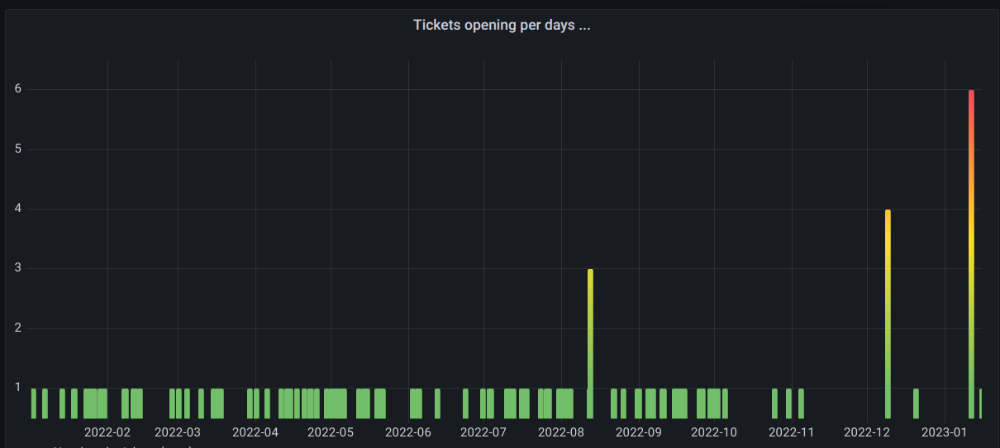
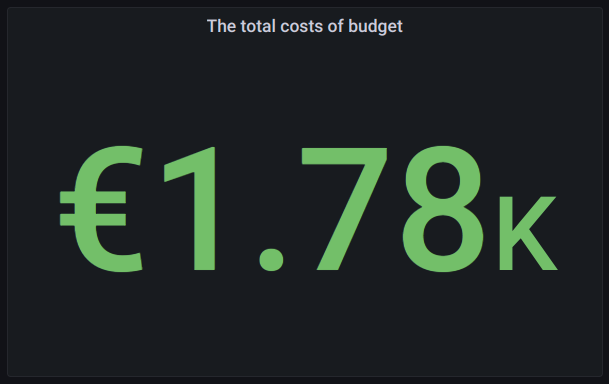
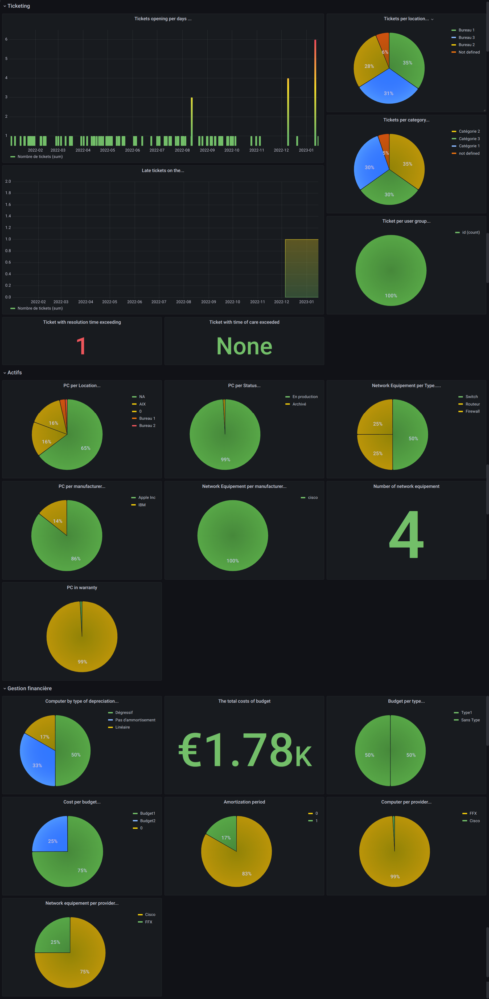
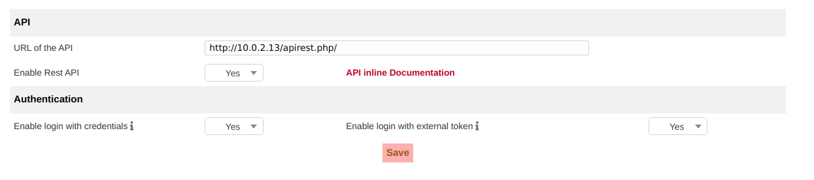
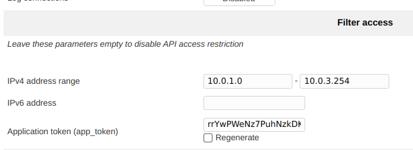
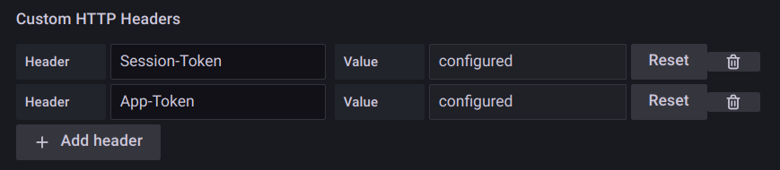

# The component of the Dashboard
## Ticketing
* a graph of opening tickets per days
  
* a graph of tickets processed late per days
* and a pie chart to view the tickets by location, category and by user group
* The number of ticket with resolution time exceeding
* The number of ticket with time of care exceeded
## Assets
* a pie chart to view the computer per location/status/types and by manufacturer.
* a pie chart to view the network equipement per manufacturer.
* The number of network equipement
* The percentage of computer in warranty
## Financial management
* The sum of the different budgets
* a pie chart to view the percent of computer per provider
* The amortization period
* The total costs of budget

  

* The network equipement per provider



# Installation
## Enable the ITSM-NG API
* Go to Setup -> General and in the API section set Enable Rest API	to YES," Enable login with credentials" and "Enable login with external token " to YES.


* Set the addresses allow to use the API. Click on full access from localhost and change the IPv4 address range.
* In this page, you must generate the app_token.



## Setup the User Token
* Go to your profile settings et generate the API Token

# Screenshot of the Dashboard


## Grafana Configuration
### Generate the Session_Token
Change APP-TOKEN and USER-TOKEN to your app_token and user_token generation in ITSM-NG. 

```
wget --quiet \
  --method GET \
  --header 'App-Token: APP-TOKEN' \
  --output-document \
  - 'http://10.0.2.13/apirest.php/initSession/?%20user_token=USER-TOKEN'
````

Now you have your session_token.

### Setup the DataSource
* Add a JSONAPI data source set the URL of your ITSM-NG in the URL field and at the end add /apirest.php for example: http://10.0.2.13/apirest.php
* Set the Session-Token and App-Token in Custom HTTP Headers



And click on Save & Test
