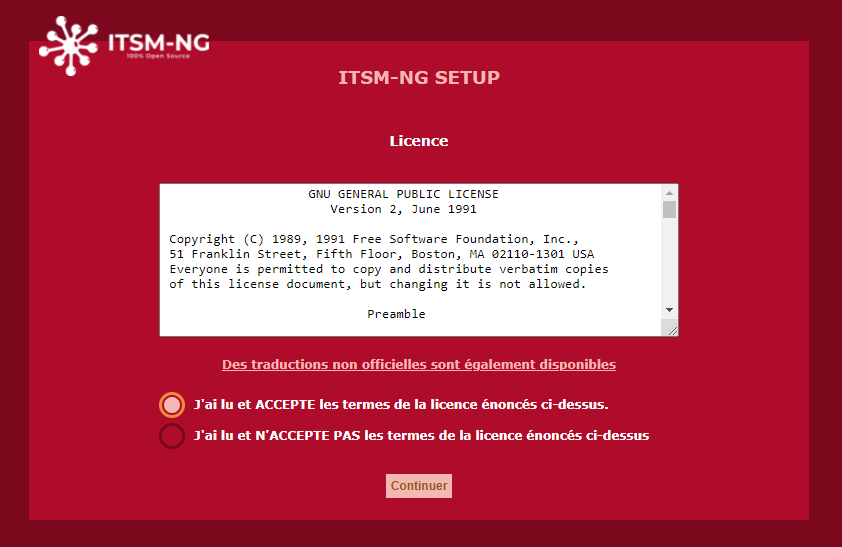
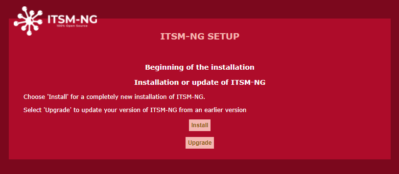
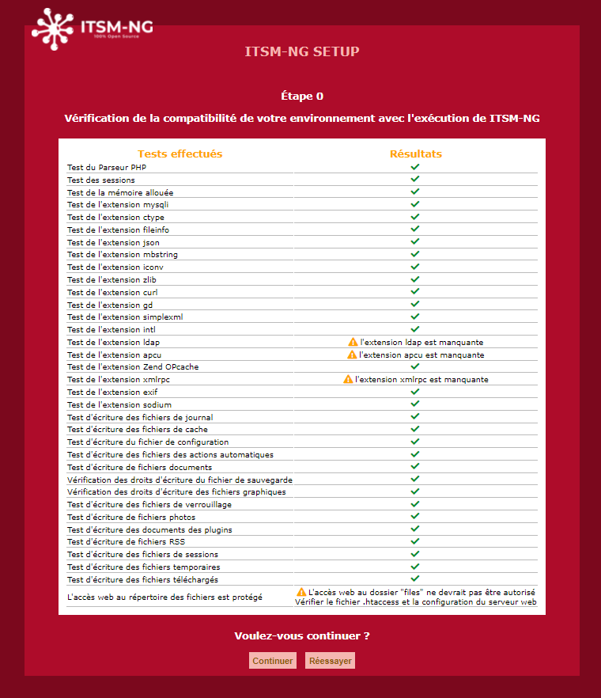
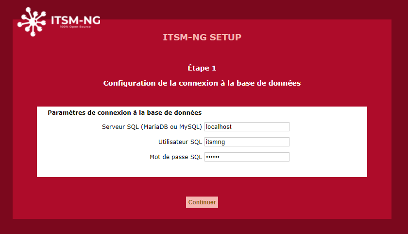
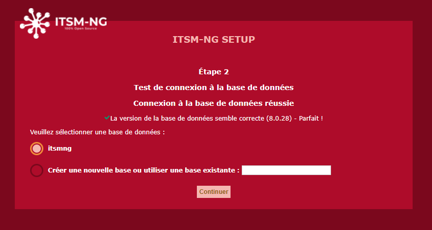
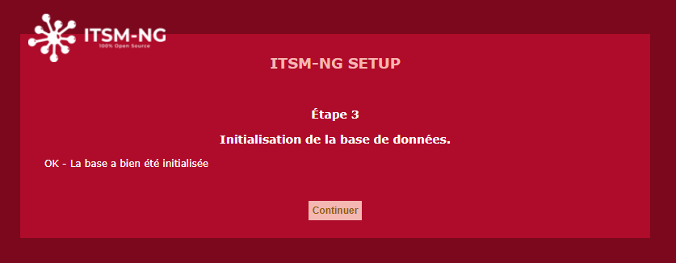
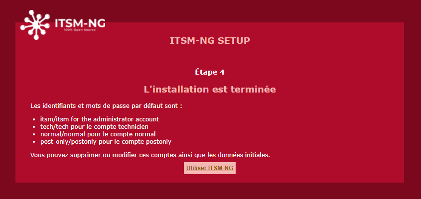

# ITSM-NG installation

## Prerequisites

To allow the installation of ITSM-NG, it is necessary to have a Linux or Windows server with the following services installed and configured : 

* Apache, Nginx, ISS, etc
* MariaDB >= 10.X or MySQL >= 5.7
* PHP 7.2 or newer

`Note on PHP : version 8.X is recommended as PHP 7.X is no longer supported by PHP.`

See [https://www.php.net/supported-versions.php](https://www.php.net/supported-versions.php) for more information.

Here is the list of **required** PHP extensions for ITSM-NG : 

* php-ctype
* php-curl
* php-gd
* php-iconv
* php-intl
* php-json
* php-mbstring
* php-mysqli
* php-simplexml
* php-zlib

The following PHP extensions are optional : 

* php-exif 
* php-imap
* php-ldap
* php-sodium
* php-zip and php-bz2
* php-apcu
* php-opcache
* php-xmlrpc

## Download 

Download the version of your choice at the following link : [https://github.com/itsmng/itsm-ng/releases](https://github.com/itsmng/itsm-ng/releases)

However, we recommend using the latest version available.

`Note : Dev and nightly versions will be available shortly for those wishing to test the latest features of ITSM-NG.`

## Pre installation

First step, connect to MySQL and create a database for ITSM-NG.

    CREATE DATABASE itsmng;

Then, create a user and configure the appropriate rights.

    CREATE USER 'itsmng'@'localhost' IDENTIFIED BY 'itsmng';
    GRANT ALL PRIVILEGES ON itsmng.* TO itsmng@localhost;
    FLUSH PRIVILEGES;

Next, uncompress the ITSM-NG release.

There are two ways to install ITSM-NG : 

* [Web installation](#web-installation)
* [Command line installation](#command-line-installation)

## Web installation

Go to [http://localhost/itsm-ng](http://localhost/itsm-ng) and follow the next steps.

Select the default language and click on `OK`.

Accept the license and click on `Continue`.

Click on `Install` to run the installation steps.

`Note : please read the `[Update documentation](update.md)` to update from an old ITSM-NG version or to migrate GLPI to ITSM-NG.`

Before configuration, a verification of the required libraries is carried out. If everything is OK, click on `Continue` otherwise install the missing libraries and click on `Try again`.

Set the MySQL configuration and click on `Continue`.

Select the database and click on `Continue`.

`Note : to create a new database from the interface, the MySQL user entered in the previous step must have the rights to create one.`

After the database initialization, click on `Continue`.

Now, you can connect to ITSM-NG with the default user itsm/itsm.

Enjoy ITSM-NG :-)

## Command line installation

Go to the ITSM-NG release folder.

Before installation, run the next command to check system requirements :

    php bin/console itsmng:system:check_requirements

Result :

| Requirement                                            | Status    | Messages                                            |
| :----------------------------------------------------- |:---------:| ---------------------------------------------------:|
| Testing PHP Parser                                     | [OK]      |                                                     |
| Sessions test                                          | [OK]      |                                                     |
| Allocated memory test                                  | [OK]      |                                                     |
| mysqli extension test                                  | [OK]      |                                                     |
| ctype extension test                                   | [OK]      |                                                     |
| fileinfo extension test                                | [OK]      |                                                     |
| json extension test                                    | [OK]      |                                                     |
| mbstring extension test                                | [OK]      |                                                     |
| iconv extension test                                   | [OK]      |                                                     |
| zlib extension test                                    | [OK]      |                                                     |
| curl extension test                                    | [OK]      |                                                     |
| gd extension test                                      | [OK]      |                                                     |
| simplexml extension test                               | [OK]      |                                                     |
| intl extension test                                    | [OK]      |                                                     |
| ldap extension test                                    | [WARNING] | ldap extension is not present                       |
| apcu extension test                                    | [WARNING] | apcu extension is not present                       |
| Zend OPcache extension test                            | [OK]      |                                                     |
| xmlrpc extension test                                  | [WARNING] | xmlrpc extension is not present                     |
| exif extension test                                    | [OK]      |                                                     |
| sodium extension test                                  | [OK]      |                                                     |
| Testing DB engine version                              | [OK]      |                                                     |
| Testing DB timezone data                               | [WARNING] | Access to timezone database (mysql) is not allowed. |
| Checking write permissions for log files               | [OK]      |                                                     |
| Checking write permissions for cache files             | [OK]      |                                                     |
| Checking write permissions for setting files           | [OK]      |                                                     |
| Checking write permissions for automatic actions files | [OK]      |                                                     |
| Checking write permissions for document files          | [OK]      |                                                     |
| Checking write permissions for dump files              | [OK]      |                                                     |
| Checking write permissions for graphic files           | [OK]      |                                                     |
| Checking write permissions for lock files              | [OK]      |                                                     |
| Checking write permissions for pictures files          | [OK]      |                                                     |
| Checking write permissions for plugins document files  | [OK]      |                                                     |
| Checking write permissions for rss files               | [OK]      |                                                     |
| Checking write permissions for session files           | [OK]      |                                                     |
| Checking write permissions for temporary files         | [OK]      |                                                     |
| Checking write permissions for upload files            | [OK]      |                                                     |

[OK] => Library installed

[WARNING] => Library not installed but optional

[ERROR] => Required library not installed

If no `ERROR` status, run the next command :

    php bin/console itsmng:database:install -H DB_HOST -u DB_USER -p DB_PASSWORD -d DB_NAME

Result :

    +---------------+------------+
    | Database host | DB_HOST    |
    | Database name | DB_NAME    |
    | Database user | DB_USER    |
    +---------------+------------+
    Do you want to continue ? [Yes/no] yes
    Installation done.

After the installation, you need to update the permission on the folder files : 

    sudo chown -R www-data: files

Now, you can connect to ITSM-NG at [http://localhost/itsm-ng](http://localhost/itsm-ng) with the default user itsm/itsm.

Enjoy ITSM-NG :-)