# Install ITSM-NG in LXC container

## Install LXC template in Proxmox

Download the LXC template

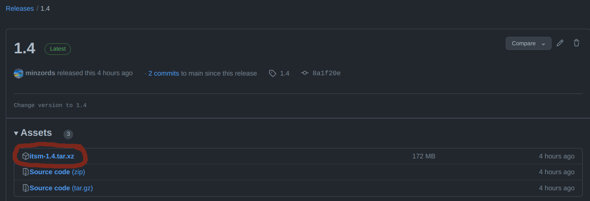

Select the LXC template storage

Click on ***CT Modeles***

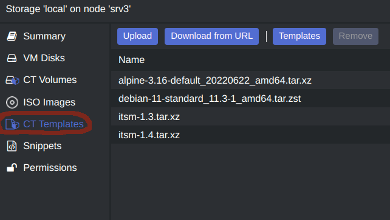

Click on ***Upload***

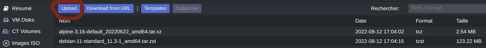

Click on ***Select*** and select the lxc template

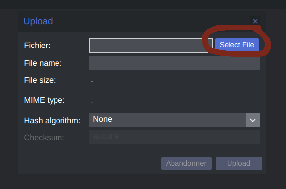

Click on ***Upload***

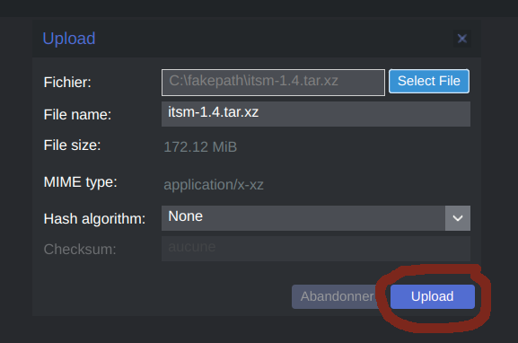

## Create LXC container in Proxmox

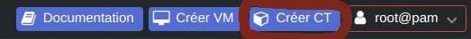
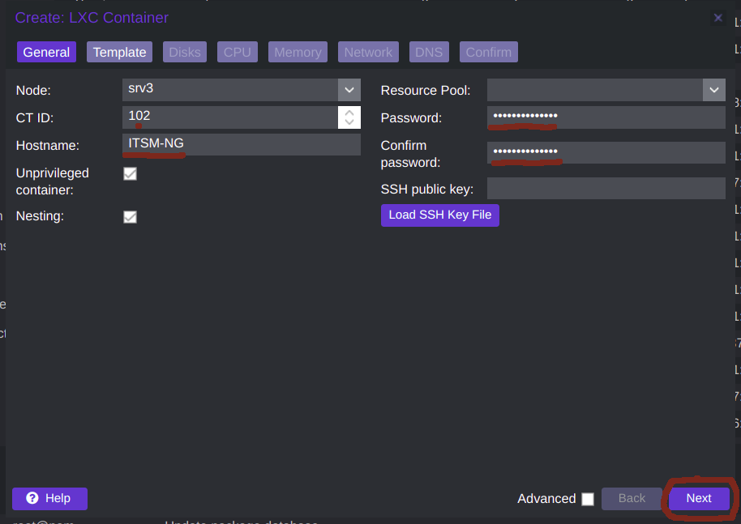

Select your ITSM-NG LXC template 

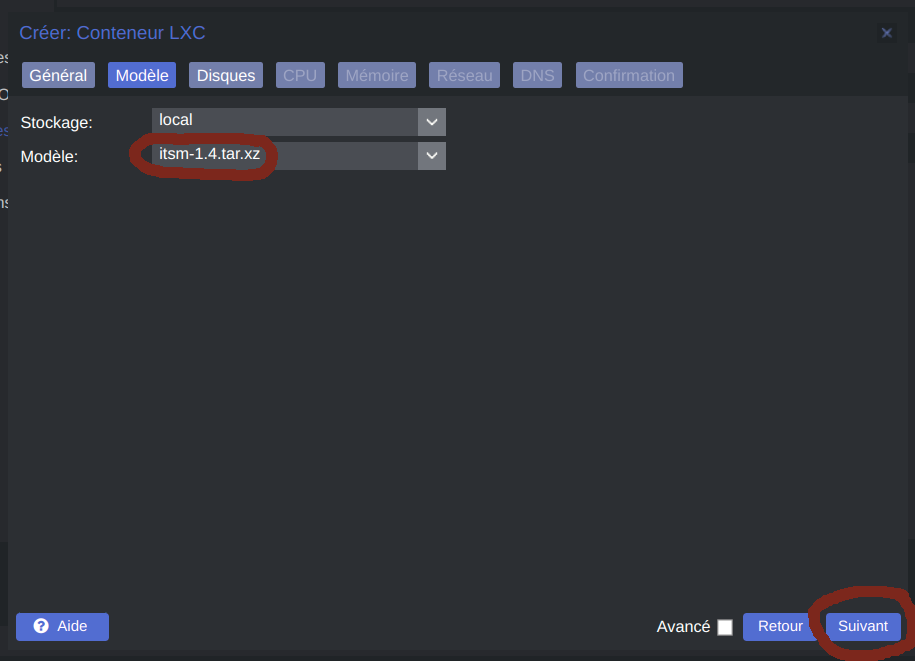

Choose how much storage do you allocate to the container
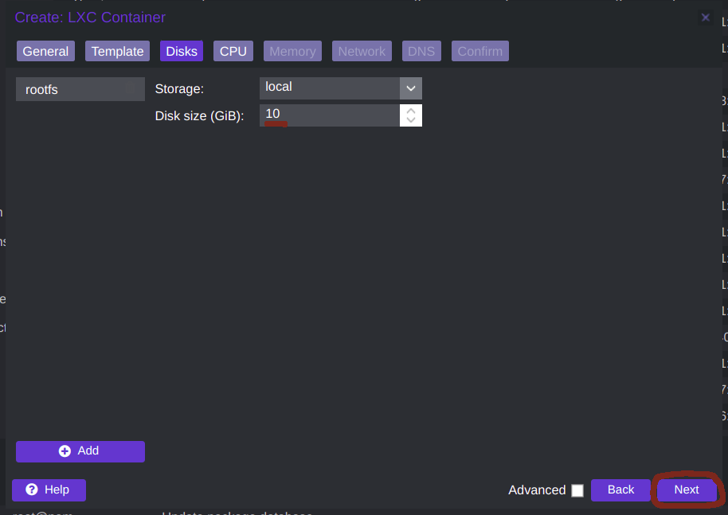

Choose how much processor do you allocate to the container
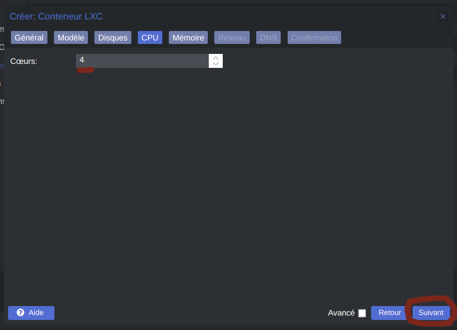

Choose how much memory do you allocate to the container
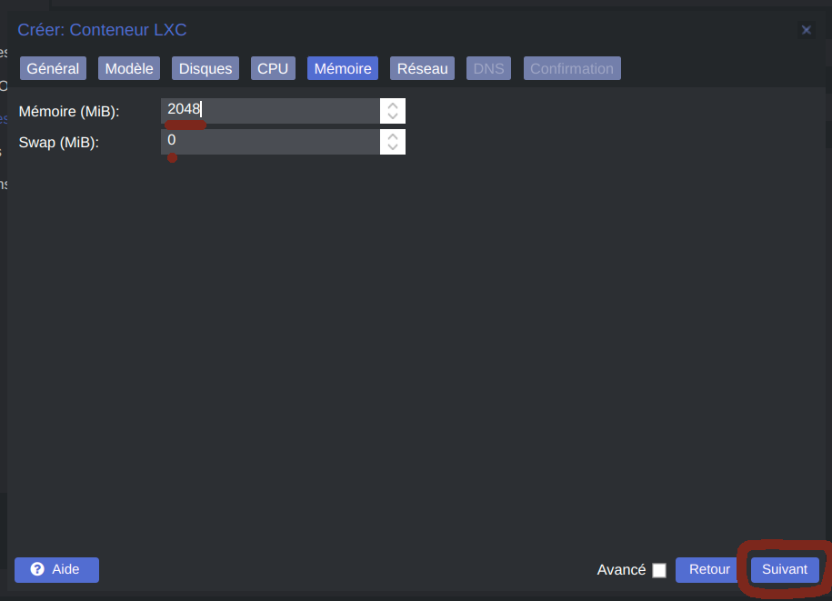

Select your network card et chose DHCP or Static address
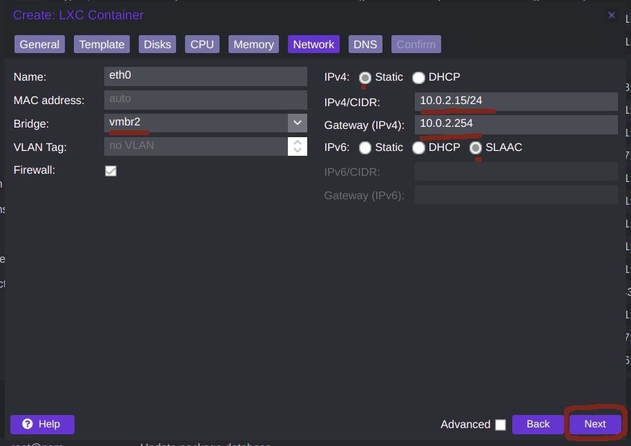

Write which DNS server your container use
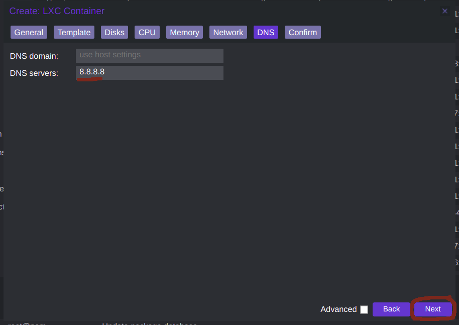

Click on start container now et Finish
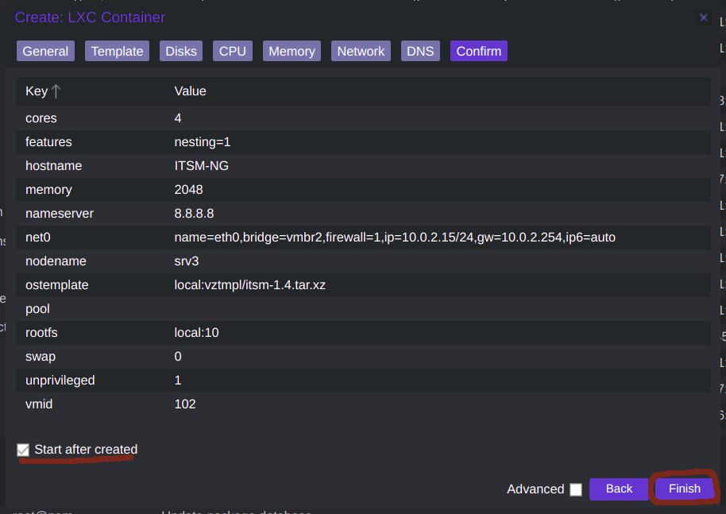

Et close the window
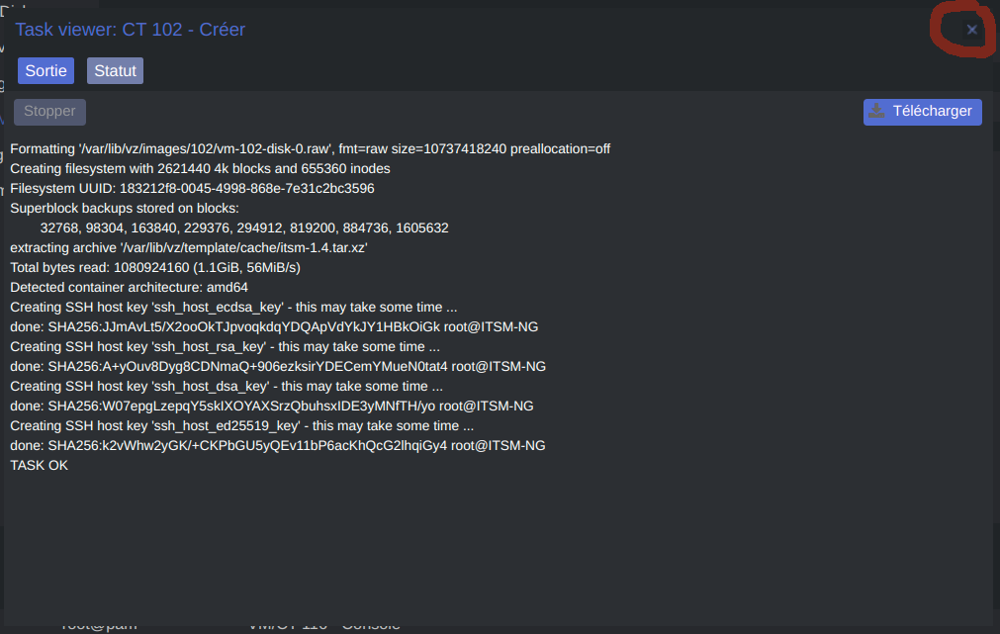

Your container is create
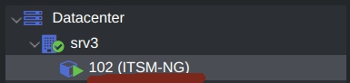

Go to the console, log in with the root user and the password you have defined
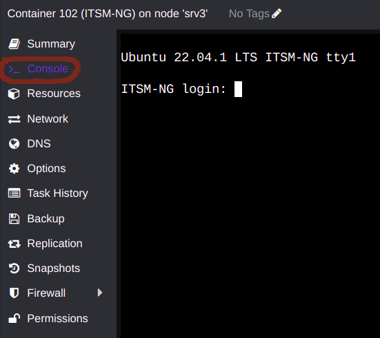

Write your MySQL username
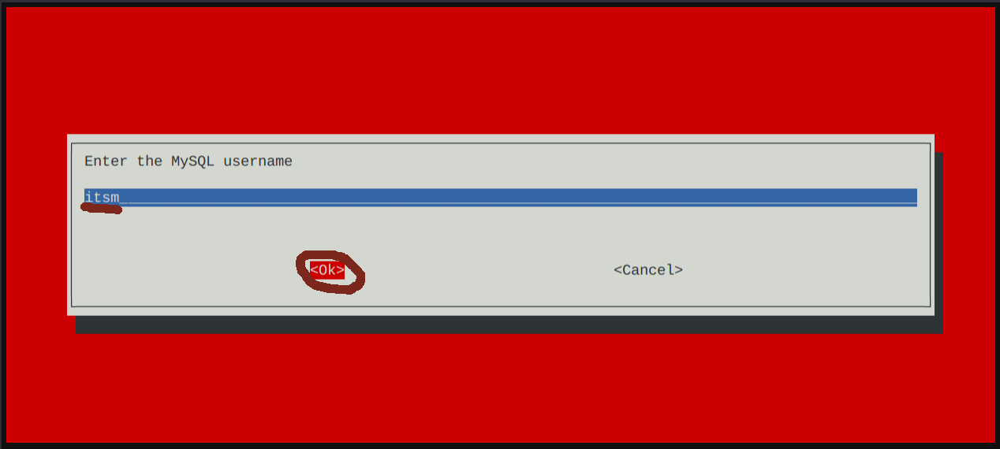

Write your MySQL password
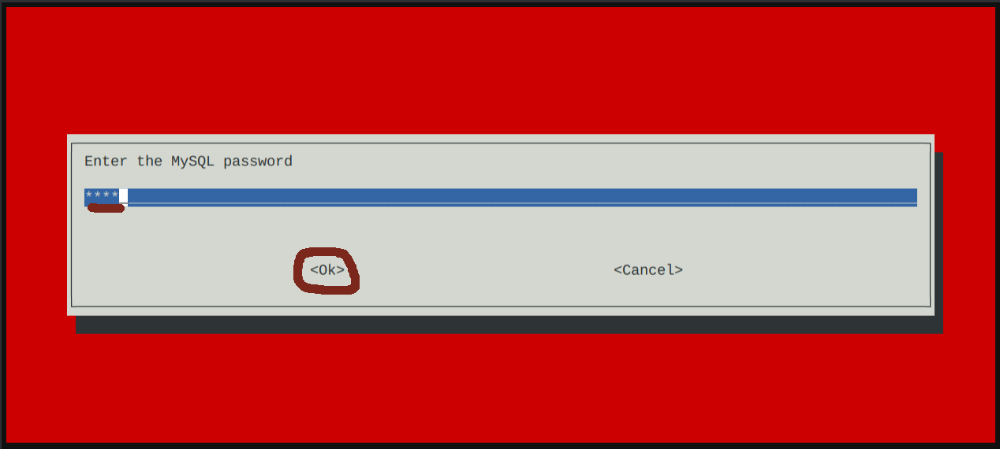

Write your database name

Installation can take several minutes
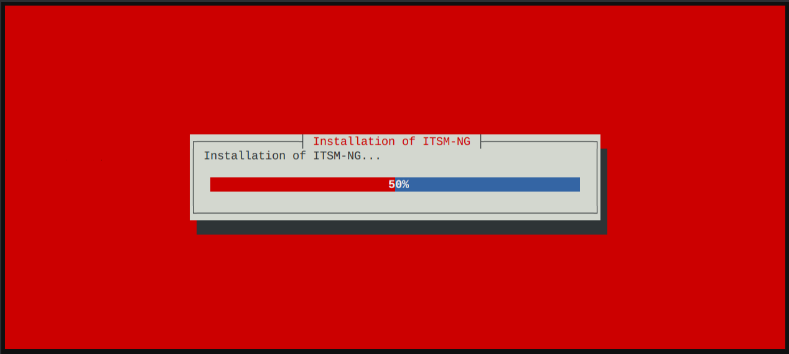

Your ITSM-NG is completely install
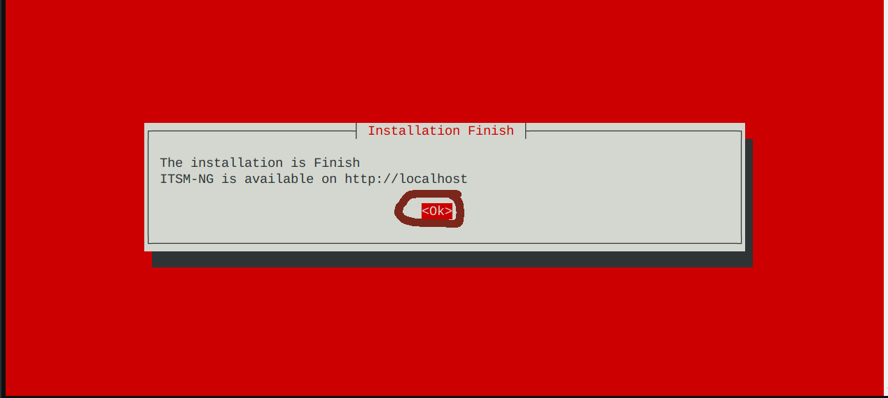

Your ITSM-NG is available on http://YOUR_IP/

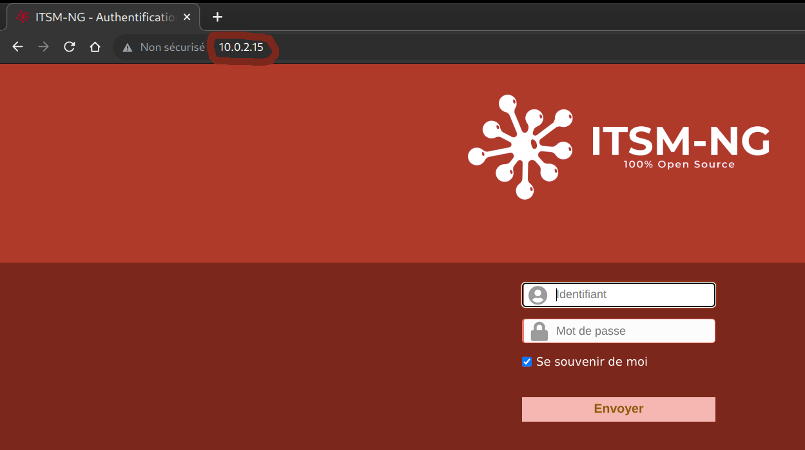

## Install in other hypervisor
This container can be use in other hypervisor other than Promox. But we do not currently offer an installation guide