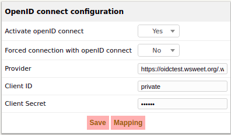
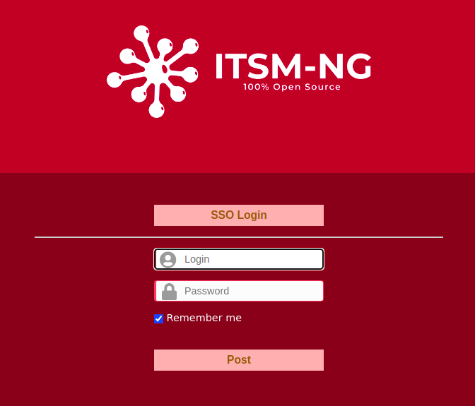

# OpenID Connect with ITSM-NG

## About OpenID Connect
This is an authentication layer on top of the OAuth 2.0 authorization framework. It allows clients to verify the identity of an end user based on the authentication performed by an authorization server.

## Dependencies

ITSM-NG will use PHP OpenID Connect Basic Client by **jumbojett**, \
a simple library that allows an application to authenticate a user through the basic OpenID Connect flow.

## How to setup ITSM-NG with OpenID Connect

### Go to Setup/Authentication/OpenID connect authentication
Here you have some options and fields to set.\

---
***⚠*** *Forced connection will redirect you directly when your are on the login page, to avoid this go to this link :*
```
http://xx.xx.xx.xx/itsm-ng/index.php?noAUTO=1
```
***⚠*** *The last 3 options need to be filled if you want use OpenID Connect*

When you set Activate OpenID connect to *yes* and submit it, you will have a new button on login page!

 \
If you click on *SSO Login* you will be redirected to your provider and you will be able to login. When it's done you have access to ITSM-NG :-)

## Useful links

To try OpenID Connect, follow this link [here](https://oidctest.wsweet.org//oauth2).

jumbojett/OpenID-Connect-PHP ([Github](https://github.com/jumbojett/OpenID-Connect-PHP))
