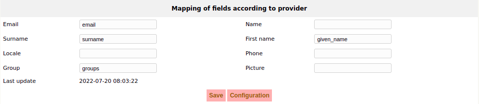

# OpenID Connect with ITSM-NG

## About OpenID Connect
OpenID Connect adds an authentication layer on top of the OAuth 2.0 authorization framework. It allows clients to verify the identity of an end user based on the authentication performed by an authorization server.

## Dependencies

ITSM-NG will use PHP OpenID Connect Basic Client by **jumbojett**, \
a simple library that allows an application to authenticate a user through the basic OpenID Connect flow.

___
## How to setup ITSM-NG with OpenID Connect

On ITSM-NG, navigate to the **Setup** section, then select **Authentication**. On the displayed page, choose **OpenID connect authentication**. 

The following instructions will guide you through the configuration process : 

## Configuration


On this first pane (see above image), **Activate openID connect** needs to be set to **Yes**.

**Forced connection with openID connect** will prevent users from connecting with any other form of authentication. \
**⚠** *Forced connection will redirect you directly when reaching the login page. To bypass the redirection, use the following link :*
```
http://xx.xx.xx.xx/itsm-ng/index.php?noAUTO=1
```

**⚠** The **Provider**, **Client ID** and **Client Secret** fields are required and must be completed with corresponding information from your authorization provider in order to use OpenID Connect.

Hit the **Save** button once done. 

## Mapping
The **Mapping** button will take you to the mapping pane (see below image). 



Depending on your authorization provider, naming of the fields may change. This section allows you to specify which fields should be used to retrieve the relevant information.

To force the update of OIDC users information in ITSM-NG, use the following command :
```
php bin/console itsmng:oidc:update
```

After activating OpenID connect, a new button will appear on the login page !


Hitting the **SSO Login** button will redirect you to your provider and you will be able to login. Once done, access to ITSM-NG is granted :-)

## Useful links

To try OpenID Connect, follow this link [here](https://oidctest.wsweet.org//oauth2).

jumbojett/OpenID-Connect-PHP ([Github](https://github.com/jumbojett/OpenID-Connect-PHP))
