# OCS Inventory NG

This plugin will synchronize your ITSM-NG with you OCS inventory NG.

## Installation

Installing this plugin is done following the standard process for itsm plugins, simply clone [the git repository](https://github.com/itsmng/ocsinventoryng) or [download a release](https://github.com/itsmng/ocsinventoryng/releases) and place it within ITSM `plugins` folder.

## Configuration

First, you need to configure your OCS server in ITSM-NG.
For that, you can click on the wrench on the plugin page, then, click on OCSNG servers and add new server.
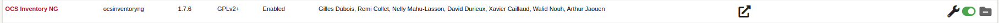

Then, you can set your server name, the host and configure your database with the database name, the user and the password.

You can also configure the data who will be imported in the configuration.
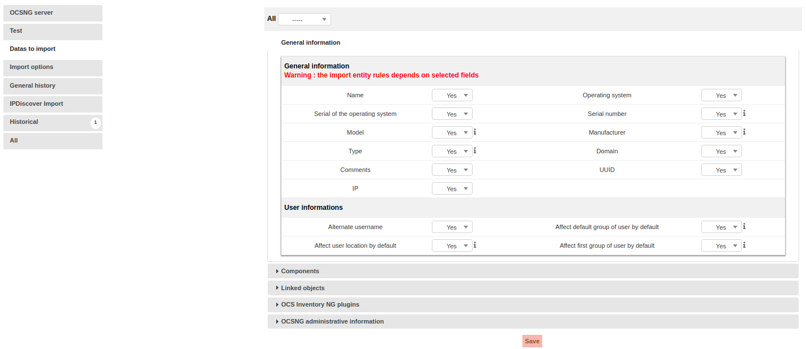

## Feature

The plugin add new page on `Tools/OCS Inventory NG`.
This page can have 4 tabs : 
- Server Setup (always here)
- Inventory Import (always here)
- IPDiscover Import (if ocs ipdiscover is configured)
- SNMP Import (if ocs ipdiscover is configured)

For each tab, you can choose your ocs server in case you have multiple ocs server configured.

### Server Setup

This tab is just a shortcut for changing the configuration of your ocs server.

### Inventory Import

In this tab, you can import new computers from OCS to ITSM-NG, synchronize computers already imported, clean computer deleted from OCS server, or Clean links between ITSM-NG and OCS. 
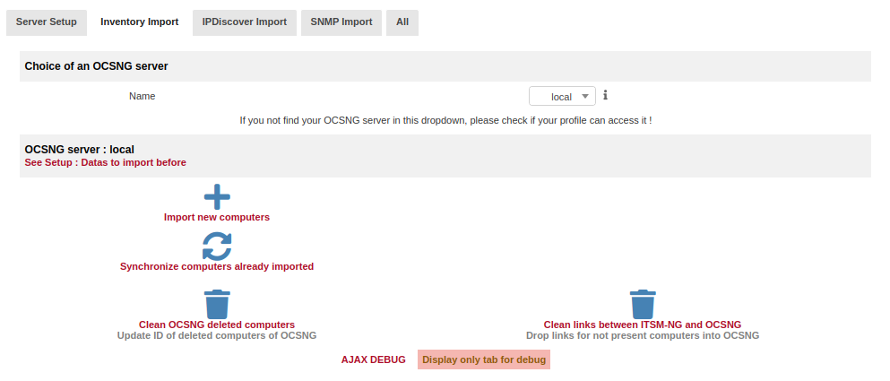

#### Import new computers :

On this page, you can see the computers present on your OCS server and not yet imported on your ITSM. 
You can select the line that you want to import or click on all on the table header to select all lines and click on  `import or link new computers` to import the computers.
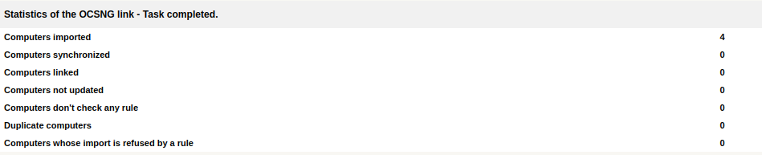

#### Synchronize computers already imported

This page work in the same way as the previous page. You can see the table of the computers already imported, select the computer and update them.

#### Clean OCSNG deleted computers

This page will clean the OCS deleted computers and display the result.
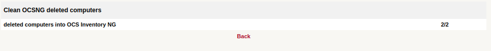

#### Clean links between ITSM-NG and OCSNG

This page is used for clean links between ITSM and OCS. On this page, you will see the computer already imported and you can check or uncheck the computer in the table and click on Clean to clean the link.
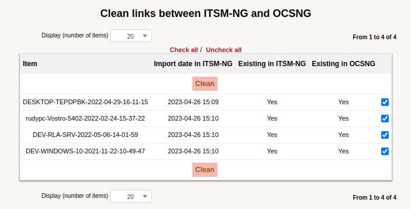

### IPDiscover Import

This tab is used to import and synchronize the IPDiscover OCS data in ITSM-NG. 

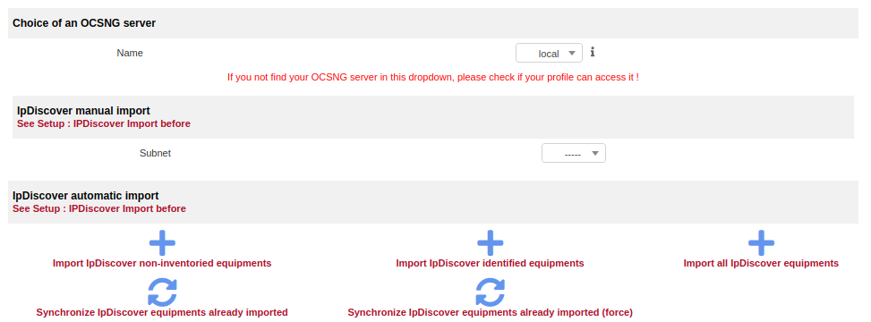

First, you can import manually the IPDiscover by selecting a subnet or show all subnets, select the non-imported, non-inventoried, inventoried, and identified subnet and then, select the device to import and set the description and the OCS type. The device will be imported in the `Assets/Network devices`.
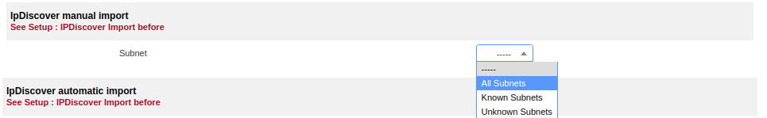

You can also import automatically by selecting with the button on the bottom of the page which element you want to import (non-inventoried, identified, or all). In this section, you can also synchronize the equipments already imported.
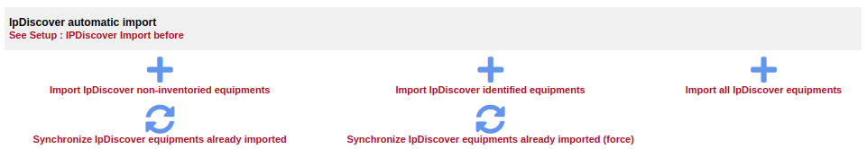

### SNMP Import

#### Configuration :

To import the SNMP devices, you need first to configure it with the link: `Link SNMP devices to existing ITSM-NG objects`. 
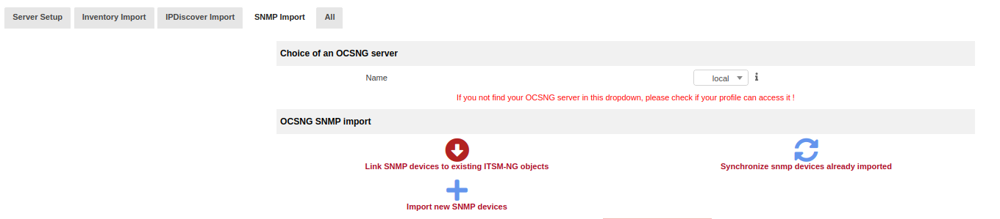
On this new page, you will show all SNMP already configured. You can add a new configuration with the button `Add`.
 In this configuration, choose the object to create in ITSM and the OCS SNMP type and then, configure the ITSM field with the OCS field correspondence.
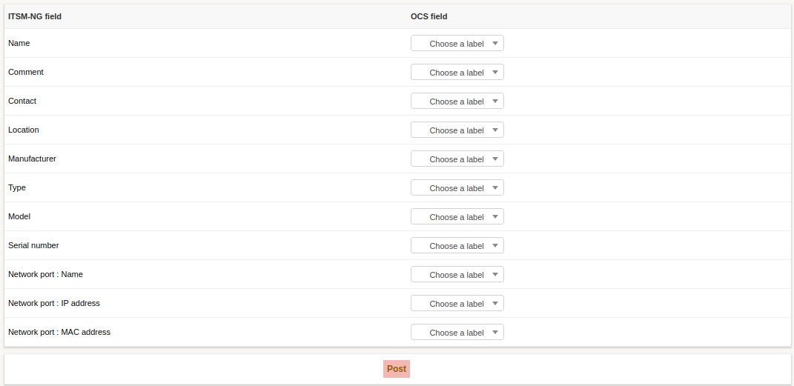

#### Import and synchronization :

After the configuration, you can import the SNMP devices from OCS to ITSM-NG. For that, click on `Import new SNMP devices`. Then, you can see all SNMP devices not yet imported and import them. You can also update the devices already imported by clicking on `Synchronize snmp devices already imported`.