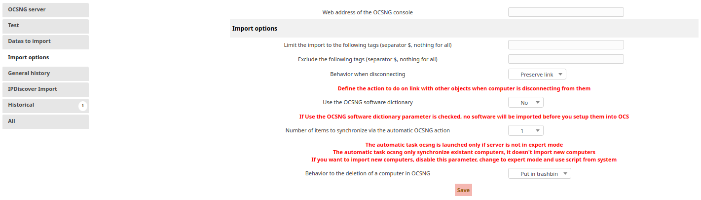

# OCS Inventory NG

This plugin allows you to synchronize OCS Inventory data in your ITSM-NG instance.

`Note: the OCS Inventory TRACE_DELETED option is required.`

## Installation

Installing this plugin is done following the standard process for itsm plugins, simply clone [the git repository](https://github.com/itsmng/ocsinventoryng) or [download a release](https://github.com/itsmng/ocsinventoryng/releases) and place it within ITSM `plugins` folder.

Unzip the plugin archive, set Apache rights and enjoy !

## Features

This plugin bundle a lot of feature in order to import the following data from OCS Inventory :

* Computers information
* Softwares information
* SNMP Scanned devices
* IpDiscover scans
* OCS' plugins information

Supported plugin list :

* Office licences
* Antivirus information
* Windows update status
* Uptime
* Teamviewer
* Windows users
* Proxy configuration
* Extended operating system information
* Services
* Custom installed application
* Network drives
* Process list
* Bitlocker

## Rights management

The OCS plugin rights are available in `Administration > Profiles > {profile_name} > OCSNG`.

* `Allowed OCSNG servers` : grant access to a configured OCS server data.
* `OCSNG servers` : can modify OCS server configuration.
* `Manually synchronization` : can manually import, synchronize and link OCS equipment.
* `See information` : can see OCS detail information for an imported equipment.
* `Clean links between ITSM-NG and OCSNG` : can clean equipment links.
* `Import computer` : can import computer.
* `Link computer` : can link computer.
* `Rules` : can update import rules.

## Configuration

### OCS server setup

To setup the connection between OCS Inventory database and ITSM-NG, go to `Tools > OCS Inventory NG` and click on `Add a OCSNG server`.

It's also possible to configure a server from `Setup > Plugins > OCS Inventory NG > OCSNG servers`.

### Data to import

This tab allows you to define which information from a computer should be imported into ITSM-NG.

### Import options

This tab allows you to configure the synchronisation options between OCS and ITSM-NG.

* `Web address of the OCSNG console` : set the OCS Inventory administration console URL. If the address is provided, a link will then be available from the detail page of a computer in ITSM-NG to redirect to the details page on OCS.
* `Limit the import to the following tags (separator $, nothing for all)` : limits the import to the machine with this OCS tag.
* `Exclude the following tags (separator $, nothing for all)` : excludes the import of the machine having this OCS tag.
* `Behavior when disconnecting` : behavior that ITSM-NG must adopt if an element connected to a machine is no longer imported/synchronized by OCS.
* `Use the OCSNG software dictionary` : allows you to synchronize/import software only from the `Dictionary` feature of OCS.
* `Number of items to synchronize via the automatic OCSNG action` : indicates the number of machines that will be synchronized by the automatic action (excluding `Expert` mode).
* `Behavior to the deletion of a computer in OCSNG` : behavior that ITSM-NG must be adopt if a machine is removed from OCS.

### General history

From this tab, you can configure the history for each executed actions.

### Rules

In `Tools > OCS Inventory NG > Server Setup`, you can configure import rules.

* `Rules for assigning an item to an entity` : setup rules to choose entity on items imports.
* `Rules for import and link computers` : setup rules to select criteria for items link.

## Import computer

You will find the computer import actions in `Tools > OCS Inventory NG > Inventory Import`.

### Manual actions

#### Import or link new computers

To import computers manually, click on `Import new computers`.

From this page, you will be able to import or link new computers on ITSM-NG.

`Note: To massively import computers, it is recommended to use the automatic import script. See Massive actions below.`

After import, you will find the `OCS Inventory NG Import informations` on the computer details page.

#### Synchronize computers already imported

To synchronize computers manually, click on `Synchronize computers already imported`.

From this page, you will be able to select all computers that you want to synchronize.

#### Clean OCSNG deleted computers

With `Clean OCSNG deleted computers`, you can clean manually the removed OCS computers from ITSM-NG.

`Note: The cleaning action is executed automatically from the moment you click on it.`

#### Clean links between ITSM-NG and OCSNG

This feature allows you to clean broken link between ITSM-NG and OCS.

A link is broken if a machine is removed from OCS or from ITSM-NG.

### Massive actions

To massively import computers, it is recommended to use automatic import script.

You will found scripts in `itsm-ng/plugins/ocsinventoryng/scripts`.

Below, the list the synchronization/import script arguments :

    sh ocsng_fullsync.sh -h

    Usage:
        ocsng_fullsync.sh [--arg]

    Arguments:
        --thread_nbr=num: number of threads to launch
        --server_id=num: ITSM-NG ID of the OCS server to synchronize from. Default is ALL the servers
        --nolog: output to console
        --debug: run in debug mode

Here, an example to script execution :

    sh ocsng_fullsync.sh --thread_nbr=1 --server_id=2 --nolog --debug

Console output :

    Fri May 12 15:30:13 UTC 2023 ocsng_fullsync.sh started
            Manage delete items in OCS server #2: "OCS-SERVER"
    =====================================================
            Thread #1: starting (1/1)
            Thread #1: import computers from server: 'OCS-SERVER'
            Thread #1: 9 computer(s) found
            Thread #1: 1 computer(s) imported
            Thread #1: 0 computer(s) synchronized
            Thread #1: 0 computer(s) linked
            Thread #1: 8 computer(s) failed import
            Thread #1: 0 computer(s) not updated
            Thread #1: 0 computer(s) not unique
            Thread #1: 0 computer(s) link refused
            Thread #1: done!!
    =====================================================
    cleaning up.
    Fri May 12 15:30:20 UTC 2023 ended

You can configure crontab to run the script regularly :

    */30 * * * * sh /var/www/itsm-ng/plugins/ocsinventoryng/scripts/ocsng_fullsync.sh --thread_nbr=2 --server_id=1

## Import IpDiscover

You will find the IpDiscover import actions in `Tools > OCS Inventory NG > IPDiscover Import`.

### Configuration

To configure IpDiscover import, click on the link `See Setup : IPDiscover Import before`.

From this page, you will be able to setup the behavior of the reconciliation between SNMP equipments and IpDiscover equipments, of the IpDiscover non-inventoried equipment and of the IpDiscover identified equipment.

#### Configuring the binding of IpDiscover and SNMP equipments

* `Merge IpDiscover equipment with SNMP equipment if IP address matches` : enable/disable the merging of IpDiscover devices with SNMP devices if the IP address matches. If an IpDiscover equipment corresponds to an SNMP equipment, it will be automatically filled in as an identified equipment in OCS.
* `Switch the equipment to identified on OCS with type` (required if the option above is enabled) : select the type of OCS network which will be automatically assigned to the IpDiscover equipment on OCS at the time of identification. 

#### IpDiscover Non-Inventoried Equipment configurations

This configuration allows you to link the specific OCS information of the non-identified IpDiscover device to a field of the  ITSM-NG Network Equipment object.

#### IpDiscover Identified Equipment configurations

By default, the identified IpDiscover equipments are imported as Network Equipment like the non-inventoried IpDiscover equipment. 

With this configuration, you will be able to select an OCS network type to be imported as an ITSM-NG object other than a Network Equipment.

### Manual actions

#### Full manual import

To import manually IpDiscover equipments, select a subnet. A table is displayed and resumes the different equipments of the subnet :

* `Non Imported` : matches with the `Non-inventoried` count in OCS if no import have been made.
* `Non Inventoried` : matches with the `Non-inventoried` count in OCS if all `Non Imported` equipments have been imported in ITSM-NG.
* `Inventoried` : matches with the `Inventoried` count in OCS.
* `Identified` : count of identified IpDiscover equipment in ITSM-NG.

To identified a `Non Imported` or a `Non inventoried` equipment, click on the count, set a `Description` and select an `OCS Type`, check the checkbox of the row and click on `Import`.

You can also choose to delete it from OCS to click on `Delete from OCSNG`.

To delete an `Identified` equipment, click on the `Identified` count, select the row and click on `Delete link`. This action remove the equipment from ITSM-NG and from OCS.

#### Semi automatic import/synchronization

To import/synchronize IpDiscover equipments, you can manually launch the automatic actions :

* `Import IpDiscover non-inventoried equipments` : imports only the non-inventoried equipments from OCS as Network Equipment with `OCSNG - Non-Inventoried` status in ITSM-NG.
* `Import IpDiscover identified equipments` : imports only the identified equipments from OCS. If no configuration has been entered for the OCS types (see `IpDiscover Identified Equipment configurations`) then they will be inventoried as Network Equipment with the status `OCSNG - Identified` in ITSM-NG.
* `Import all IpDiscover equipments` : imports all types of IpDiscover equipment combined from OCS in ITSM-NG.
* `Synchronize IpDiscover equipments already imported` : synchronizes the imported equipments if necessary.
* `Synchronize IpDiscover equipments already imported (force)` : force the synchronization of all imported equipments.

### Massive actions

To massively import IpDiscover equipments, it is recommended to use automatic import script.

You will found scripts in `itsm-ng/plugins/ocsinventoryng/scripts`.

Below, the list the synchronization/import script arguments :

    sh ocsng_ipdiscoverfullsync.sh -h

    Usage:
        ocsng_ipdiscoverfullsync.sh [--arg]

    Arguments:
        --thread_nbr=num: number of threads to launch
        --server_id=num: ITSM-NG ID of the OCS server to synchronize from. Default is ALL the servers
        --ipd_to_inventory=[full, noninventoried, identified]: Default full
        --nolog: output to console
        --debug: run in debug mode
        --force: force update on all IpDiscover datas

Here, an example to script execution to import non-inventoried equipments :

    sh ocsng_ipdiscoverfullsync.sh --thread_nbr=1 --server_id=2 --ipd_to_inventory=noninventoried --nolog --debug

Console output :

    Fri May 19 14:00:08 UTC 2023 ocsng_ipdiscoverfullsync.sh started
    =====================================================
            Thread #1: starting (1/1)
            Thread #1: synchronize IpDiscover objects from server: 'OCS-SERVER'
            Thread #1: 20 object(s) imported
            Thread #1: 0 object(s) updated
            Thread #1: 0 object(s) removed
            Thread #1: done!!
    =====================================================
    cleaning up.
    Fri May 19 14:00:14 UTC 2023 ended

You can configure crontab to run the script regularly :

    */30 * * * * sh /var/www/itsm-ng/plugins/ocsinventoryng/scripts/ocsng_ipdiscoverfullsync.sh --thread_nbr=1 --server_id=1 --ipd_to_inventory=full

`Note : If you use the reconciliation option between IpDiscover and SNMP devices, it is recommended to import only non-inventoried IpDiscover devices.`

## Import SNMP equipment

You will find the SNMP equipment import actions in `Tools > OCS Inventory NG > SNMP Import`.

### Configuration

Before SNMP import, you must configure the reconciliation between the OCS SNMP fields and the ITSM-NG object fields.

Click on `Link SNMP devices to existing ITSM-NG objects` and `Add`. Select the ITSM-NG object and the OCS SNMP type and click on `Post`. This SNMP type will be imported as this object.

Now, select the OCS field that will be inventoried in the ITSM-NG equipment's field and click on `Post`.

In `Link SNMP devices to existing ITSM-NG objects`, you can also see and manage all SNMP type configurations.

Click on the wrench to edit the configuration of a type or click on the cross to remove this configuration.

### Manual actions

To manually import SNMP equipments, click on `Import new SNMP devices`. Select the equipments that you want to import and click on `Import`.

`Note : SNMP devices can only be imported if their type is configured.`

To manually synchronize SNMP equipments, click on `Synchronize snmp devices already imported`. Select the equipments that you want to synchronize and click on `Synchronize`.

### Massive actions

To massively import SNMP equipments, it is recommended to use automatic import script.

You will found scripts in `itsm-ng/plugins/ocsinventoryng/scripts`.

Below, the list the synchronization/import script arguments :

    sh ocsng_snmpfullsyncrework.sh -h
    Usage:
        ocsng_snmpfullsyncrework.sh [--arg]

    Arguments:
        --thread_nbr=num: number of threads to launch
        --server_id=num: ITSM-NG ID of the OCS server to synchronize from. Default is ALL the servers
        --nolog: output to console
        --debug: run in debug mode

Here, an example to script execution to import equipments :

    sh ocsng_snmpfullsyncrework.sh --thread_nbr=1 --server_id=2 --nolog --debug

Console output :

    Fri May 19 14:28:17 UTC 2023 ocsng_snmpfullsyncrework.sh started
            Thread #-1: synchronize SNMP objects from server: 'OCS-SERVER'
            Thread #-1: 0 object(s) updated
            Thread #-1: 0 object(s) not updated
            Thread #-1: 3 object(s) imported
            Thread #-1: 0 object(s) failed import
            Thread #-1: done!!
    =====================================================
    =====================================================
            Thread #1: starting (1/1)
            Thread #1: synchronize SNMP objects from server: 'OCS-SERVER'
            Thread #1: 3 object(s) updated
            Thread #1: 0 object(s) not updated
            Thread #1: 0 object(s) imported
            Thread #1: 0 object(s) failed import
            Thread #1: done!!
    =====================================================
    cleaning up.
    Fri May 19 14:28:20 UTC 2023 ended

You can configure crontab to run the script regularly :

    */30 * * * * sh /var/www/itsm-ng/plugins/ocsinventoryng/scripts/ocsng_snmpfullsyncrework.sh --thread_nbr=1 --server_id=1
