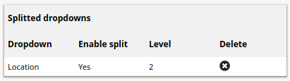
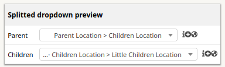

# Split dropdown

This plugin allows you to split a dropdown into multiple dropdowns based on the level of splitting you want.

## Installation

Installing this plugin is done following the standard process for itsm plugins, simply clone [the git repository](https://github.com/itsmng/splitdropdown) or [download a release](https://github.com/itsmng/splitdropdown/releases) and place it within itsm's `plugins` folder.

Unzip the plugin archive, set Apache rights and enjoy !

## Usage

Go to `Configuration > Plugins` and click on `Split dropdown` to access the configuration.

* Dropdown : select the dropdown to split (ITIL Categories / Locations)
* Enable split : Enable or disable splitting
* Level : splitting level

The splitting dropdown list is displayed below.

When you add a new enabled splitted dropdown, a preview is displayed for you to test the dropdown split.

`Note : a splitted dropdown is updated when you added the same dropdown type.`