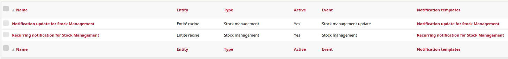
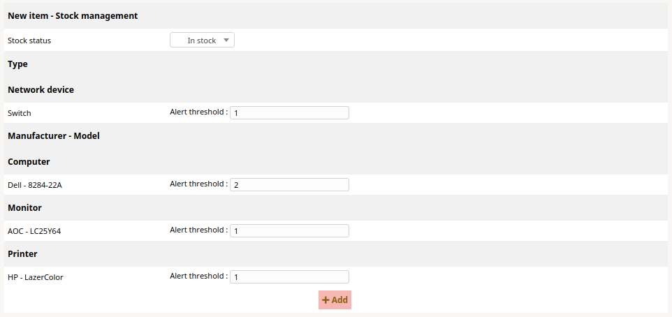
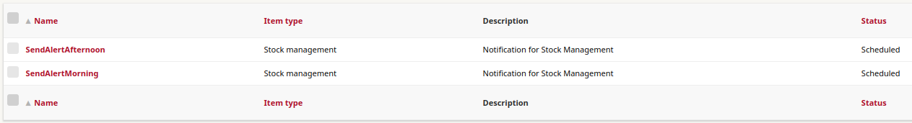
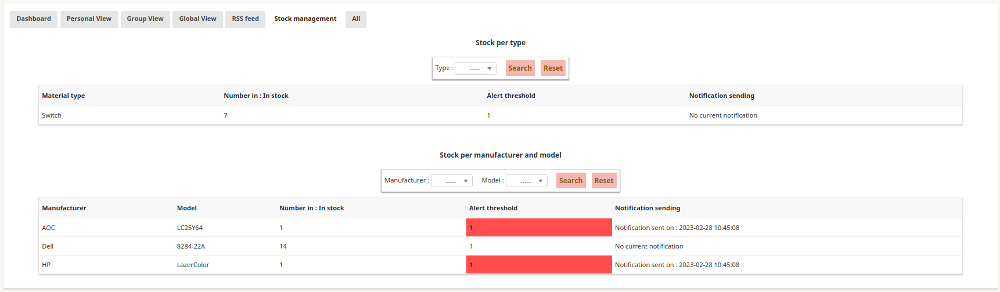

# ITSM Stockmanagement

This plugin allows you to configure an alert threshold for a type of material or for a manufacturer/model depending on a status.

## Installation

Installing this plugin is done following the standard process for itsm plugins, simply clone the git or download a release and place it within ITSM-NG `plugins` folder.

Don't forget to set Apache rights, and enjoy !

## Usage

### Notifications

When the plugin is installed, two notifications are added.

* Notification update for Stock Management : sending when you update the alert threshold configuration.
* Recurring notification for Stock Management : sending by the automatic actions.

Both notification are added with a default template. Below, you will find the list of available tags for Stock management :

* lang.stockmanagement.listmanufacturer
* stockmanagement.listmanufacturer
* lang.stockmanagement.listtype
* stockmanagement.listtype

### Configuration

The first step is to configure the alert threshold.

Go to `Tools > Stock management`, fill in the alert threshold you want for each type or for each manufacturer/model and click on `Add` to save.

`Note: setting the value to zero means disabling the alert threshold for the item.`

### Automatic actions

When the plugin is installed, two automatic actions are added.

The automatic actions send the alert threshold notifications.

### Dashboard

The dashboard is available on the home page.

`Note: the dashboard data are updated when the automatic action is launched or when the configuration is updated`.