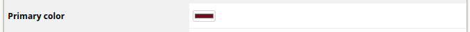
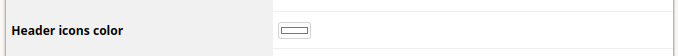
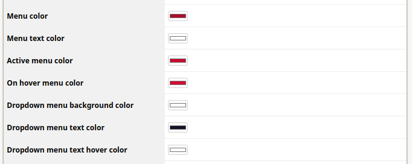
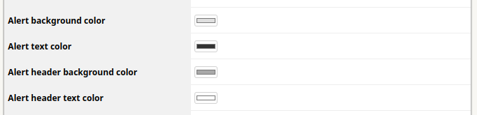
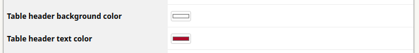
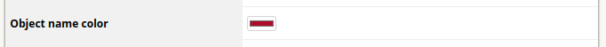
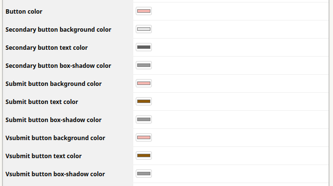
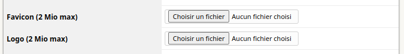
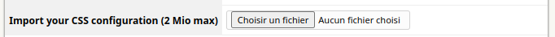

# White Label

This plugins aims to allow its users to modify the look of their ITSM-NG application, unifying their internal software's appearance.

## Installation

Installing this plugin is done following the standard process for itsm plugins, simply clone [the git repository](https://github.com/itsmng/whitelabel) or [download a release](https://github.com/itsmng/whitelabel/releases) and place it within ITSM `plugins` folder.

Unzip the plugin archive, set Apache rights and enjoy !

## Features

To custom the theme, go to `Setup > Plugins` and click on `White Label` plugin name.

The `Primary color` corresponds to the top part color of the navigation bar.

The `Header icons color` corresponds to the icons color at the top right of the navigation bar.

The `Menu color` section allows you to fully customize the colors of the menu.

The `Alert` section changes the style of the popups that appear at the bottom right of your screen when you create or update an item.

With these options, you can customize the table headers style.

This option changes the color of the name of the object present in the various tables of the application.

The `Button color` section allows you to customize the style of all button type of ITSM-NG.

With these options, you can update the favicon application and the logos present at the top left of navigation bar and on the login page.

The Whitelabel plugin allows you to import your own css file.

Don't forget to save after modifications.

## Restore the ITSM-NG colors and logos

To restore ITSM-NG theme colors, go to `Setup > Plugins` and click on `White Label` plugin name.

At the bottom of the configuration form, you will find the `Restore colors` button. Click on it and .. TADAAAM ! The ITSM-NG colors are restored.

To restore logos or favicon, check the option you want to remove and click on `Save`.