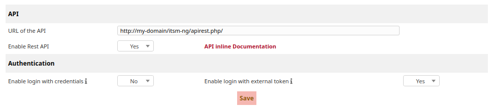
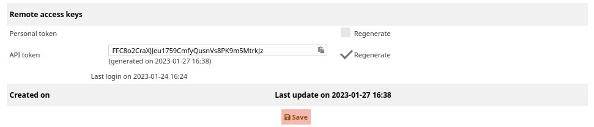
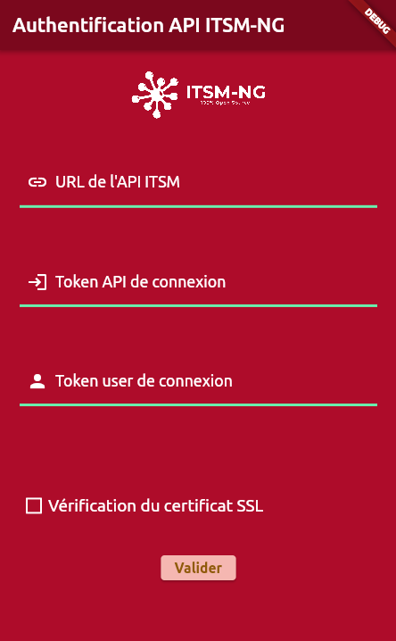
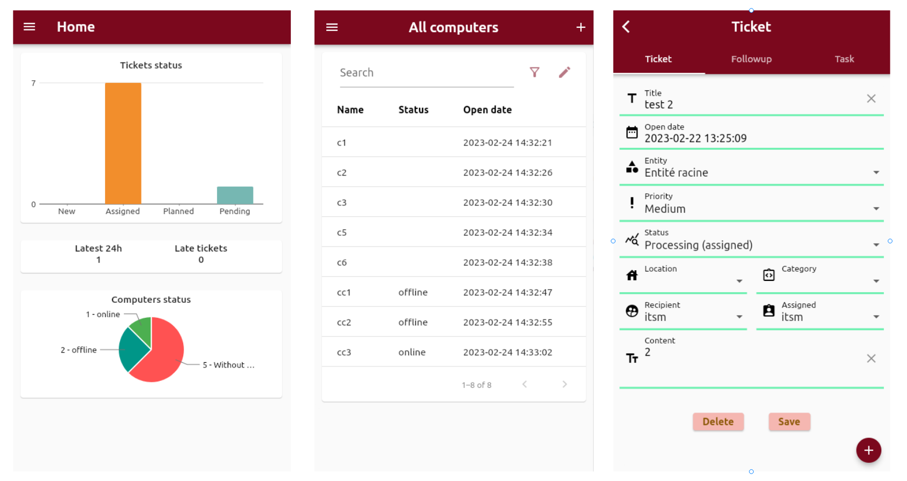

# Android application

## Introduction

This is a cross platform application. This application allow to the list, create, modify, show more information of a ticket or a computer. 

## Configurations

### ITSM-NG configuration

To use the application, you should configure the API feature of your ITSM-NG.

Go to `Setup > General > API`, and enable the `Rest API`.

Allowing a user to connect to the API, there are two options but currently our application is setting up to use the second option:

* `Enable login with credentials` : allows the user to connect through the couple login and password separated by `:` in a Base64 string.
* `Enbale login with external token` : allows the user to connect through the `API token` configure directly in the user page configuration.

`Note: we recommend to only enable the login with external token for more security.`

Next, you need to configure an `API client` to allow the application to issue API calls to your ITSM-NG.

Click on `Add API client`.

Set a `name`, `Active` to `YES`, an `IPv4  address range` if you want to limit access to specific clients and check `Regenerate` for `Application token`.

Click on `Add`.

Then, go to the configuration page of the user who will be authorized to connect via the API and check `Regenerate` for the `API token`.

Click on `Save`.

### Application configuration

Run the application and fill the form with `URL` , `API token` and `User token`

Click on `Send`.

## Application features

* Reporting 
    * Ticketing
        * Ticket per status (New, Assigned, Planned, Pending)
        * Late ticket
        * Latest 24h ticket
    * Computer
        * Computer per status

* List of ticket
    * Display all tickets
    * Let to change the default field (Name, Status, Open date) 
    * Sort by Name or by the second field
    * Filter by status
    * Search a ticket
    * Add a new ticket

* List of computer
    * Display all computer
    * Let to change the default field (Name, Status, Open date) 
    * Sort by Name or by the second field
    * Filter by status
    * Search a computer
    * Add a new computer

* Ticket detail
    * Show ticket information (Title / Priority / Entity / Location / Assigned etc...)
    * Allow to delete or modify the ticket
    * List of the associated Followup and Task
    * Add new Followup and Task for the current ticket

* Computer detail
    * Show computer information (Name / Update source / Serial / Location / Assigned etc...)
    * Allow to delete or modify the computer
    * List of the associated Ticket
    * Add new Fticket associated to the current computer

* Configuration    
    * Change the ITSM-NG configuration

* Language
    * The default language depends on the device language
    * Allow to change the language

* Logout
    * kill the session and redirect to authentification page

## Somes samples

## List of pages

* Home page : default page which contains Ticketing report (group by status / late / latest 24h) in a bar chart and Computer report (group by status) in a pie chart.
* Ticket page : display the list of tickets 
* Computer page: display the list of computers
* Add tciket : page to create a new ticket
* Add computer : page to create a new computer
* Ticket information : show ticket information 
* Computer information : show computer information
* Configuration: this page is used to set the ITSM-NG configuration (URL / App token / User token)

## Error handling

* Send a alert if the data are empties
* Control empty formd and incorrect param
* Generate a time out 
