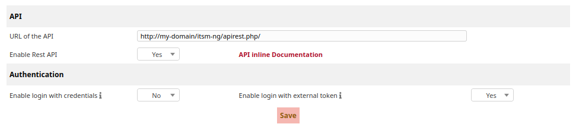
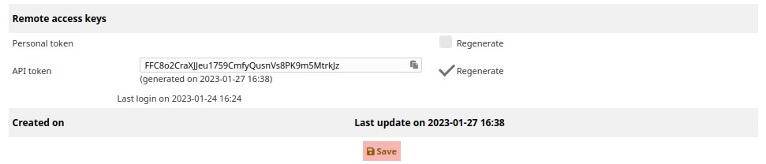
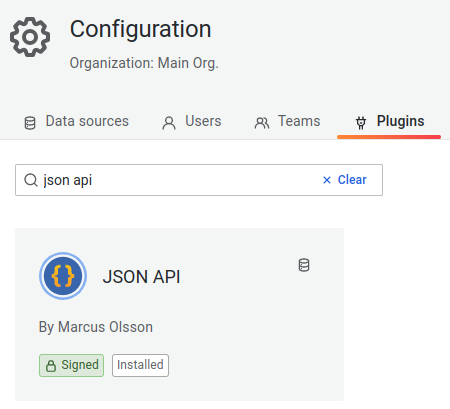
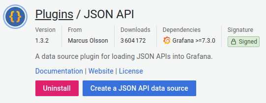
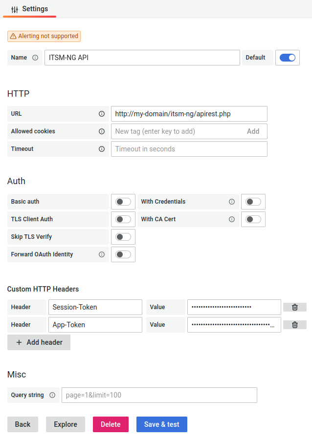
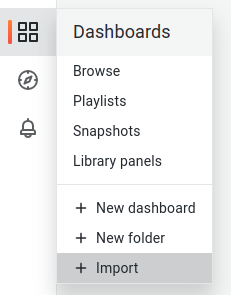
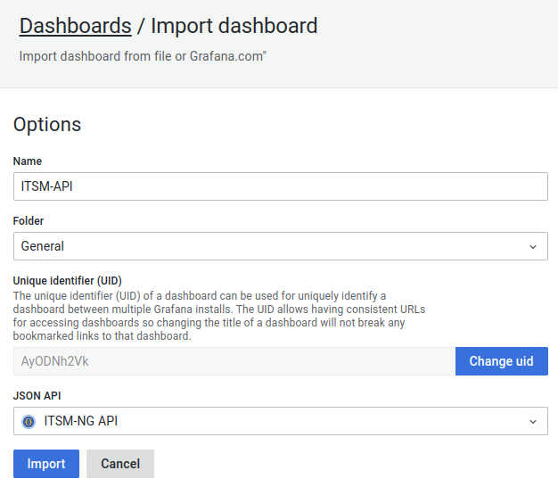
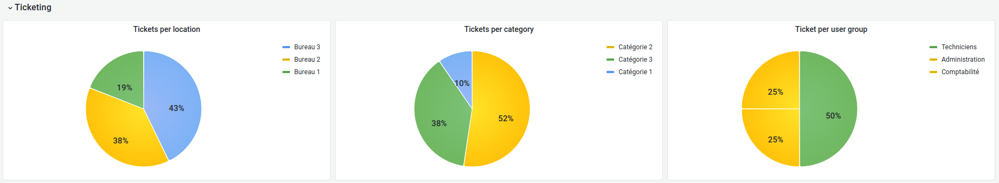
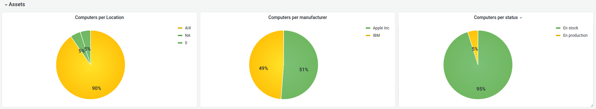
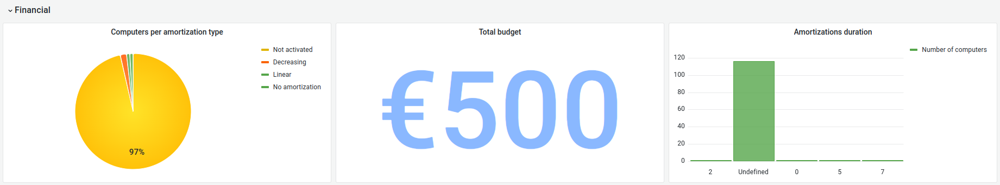

# Grafana dashboard

## Introduction

Grafana is the open source analytics & monitoring solution that allow you to manage dashboard and unify multiple data sources.
We provide a default template which can be used in order to provide reporting.

To setup Grafana, please refer to the official documentation : [Install Grafana](https://grafana.com/docs/grafana/latest/setup-grafana/installation/)

## Setup Grafana dashboard

### ITSM-NG configuration

#### Enable and configure API

To use Grafana with ITSM-NG, you should configure the API feature of your application.

Go to `Setup > General > API`, and enable the `Rest API`.

To allow a user to connect to the API, there are two options :

* `Enable login with credentials` : allows the user to connect through the couple login and password separated by `:` in a Base64 string.
* `Enbale login with external token` : allows the user to connect through the `API token` configure directly in the user page configuration.

`Note: we recommend to only enable the login with external token for more security.`

Next, you need to configure an `API client` to allow your Grafana server to issue API calls to your ITSM-NG application.

Click on `Add API client`.

Set a `name`, `Active` to `YES`, an `IPv4  address range` if you want to limit access to specific clients and check `Regenerate` for `Application token`.

Click on `Add`.

Then, go to the configuration page of the user who will be authorized to connect via the API and check `Regenerate` for the `API token`.

Click on `Save`.

#### Generate Session-Token

To use the ITSM-NG API, you should generate a user `Session-Token`.

This token will be used by Grafana to execute the API calls.

To generate a `Session-Token`, get the `Application token` in the `Client API` configuration and the `API token` in the user configuration.

Use the `/initSession` API endpoint to retrieve the `Session-Token` :

	$ curl -X GET \
	-H 'Content-Type: application/json' \
	-H "Authorization: user_token MY_API_TOKEN" \
	-H "App-Token: MY_APPLICATION_TOKEN" \
	'http://my-domain/itsm-ng/apirest.php/initSession'

If your API is correctly configured, the query return you the user `Session-Token` :

	{
		"session_token": "83af7e620c83a50a18d3eac2f6ed05a3ca0bea62"
	}

### Grafana configuration

#### Configure ITSM-NG JSON API data source

The first step to configure `JSON API data source` is to install the `JSON API` plugin on your Grafana.

Go to `Configuration > Plugins` and search `JSON API` and install the plugin.

Next, click on `Create a JSON API data source` to create your ITSM-NG configuration.

Set a `Name`, your ITSM-NG `URL of the API` and add two header `Session-Token` and `App-Token`. See `ITSM-NG configuration` above to retrieve all information.

Then, click on `Save & test`.

#### Import the ITSM-NG dashboard

ITSM-NG provides a default dashboard.

To retrieve the template, clone the next GitHub repository :

	git clone https://github.com/itsmng/grafana-template.git

Or download the JSON file :

	wget https://raw.githubusercontent.com/itsmng/grafana-template/main/ITSM-API.json

Next, in your Grafana, click on the Dashboard icon and `Import`.

Click on `Upload JSON file` and select the `ITSM-API.json` on the `grafana-template` folder.

You can update the `Name` as you want and select the previously created `JSON API` data source.

Click on `Import`.

## Report list 

The default provided dashboard contains three different type of reporting : 

* Ticketing
	* Tickets opened per day
	* Tickets per location / category / user group
	* Tickets with exceeded resolution time
	* Tickets with exceeded resolution time last month
	* Tickets with time to open exceeded last month

* Assets
	* Computers per location / status / warranty / manufacturer
	* Network equipment per type / manufacturer
	* Number of network equipment

* Financial
	* Total budget
	* Budget per type
	* Expenses per budget
	* Amortizations duration
	* Computers per supplier / amortization type
	* Network equipment per supplier

