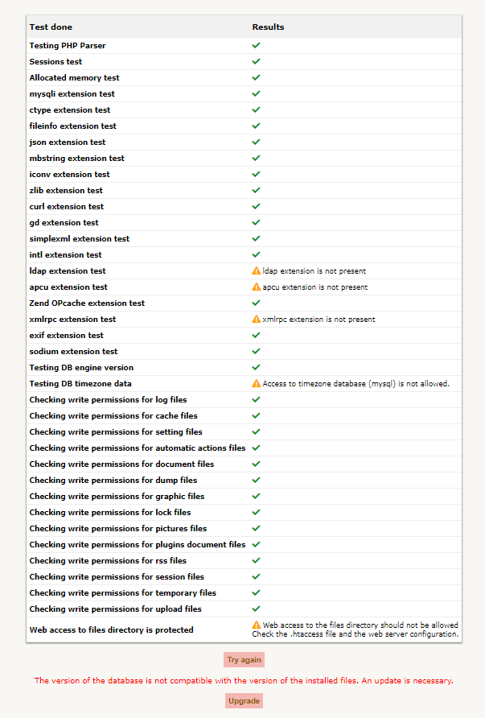
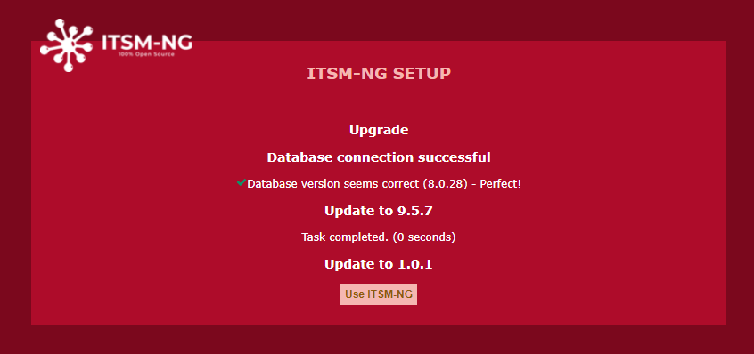

# Update ITSM-NG or migrate from GLPI

`Note: before each update, it is recommended to make a backup of the data as well as to test first on a development infrastructure in order to validate the integrity of the data.`

`WARNING` : it is not possible to migrate GLPI 10 to ITSM-NG.

## Update or migrate

Download the latest version of ITSM-NG at the following link : https://github.com/itsmng/itsm-ng/releases

Uncompress the release in the same directory as the currently installed version.

There are two ways to update ITSM-NG or to migrate from GLPI :

* [Update from web](#update-from-web)
* [Update from command line](#update-from-command-line)

## Update from web

First step, copy the `config_db.php` and `glpicrypt.key` files present in the old folder `itsm-ng/config` or `glpi/config` in the new folder `itsm-ng/config`.

Then, go to your ITSM-NG or GLPI url.

If the requirements are OK, click on `Upgrade`.

Above, an example of a GLPI 9.5.6 migration to ITSM-NG 1.0.1.

Click on `Use ITSM-NG` then log in with your usual credentials. 

## Update from command line

First step, copy the `config_db.php` and `glpicrypt.key` files present in the old folder `itsm-ng/config` or `glpi/config` in the new folder `itsm-ng/config`.

Then, run the following command :

    php bin/console itsmng:database:update

Result :

    +--------------------------+-----------+--------+
    |                          | Current   | Target |
    +--------------------------+-----------+--------+
    | Database host            | DB_HOST   |        |
    | Database name            | DB_NAME   |        |
    | Database user            | DB_USER   |        |
    | ITSM-NG version          | 1.0.0     | 1.0.1  |
    | ITSM-NG database version | 1.0.0     | 1.0.1  |
    +--------------------------+-----------+--------+
    Do you want to continue ? [Yes/no] yes
    ========================================= Update to 9.5.7 ==========================================
    ========================================= Update to 1.0.1 ==========================================
    Migration done.

Above, an example of a GLPI 9.5.6 migration to ITSM-NG 1.0.1.

Next, go to your ITSM-NG or GLPI url and log in with your usual credentials. 